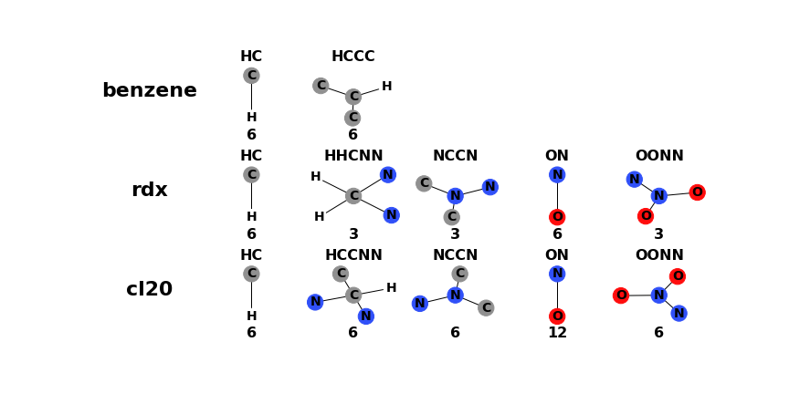

******
PyMoVE
******
Library and utilities for training volume estimation models with PyMoVE. 

This library is published to accompany the following peer-review article. Please cite this article for any work that makes use of the PyMoVE library.

Bier, I., & Marom, N. (2020). Machine Learned Model for Solid Form Volume Estimation Based on Packing-Accessible Surface and Molecular Topological Fragments. The Journal of Physical Chemistry A, 124(49), 10330-10345.

`doi.org/10.1021/acs.jpca.0c06791 <https://doi.org/10.1021/acs.jpca.0c06791>`_

Installation
============

It's highly recommended to start from an Anaconda distribution of Python, which can be found here_. 

Current full installation requires running two ``setup.py`` scripts. This will be modified in the near future. This is because the algorithm that enables the project marching cube algorithm relys on Numba compilation to run efficiently. The algorithm is still accessible and built in pure Python if a user cannot compile with Numba for any reason. But will require some changes. Please open an issue on github if these changes are required for you. 

Running the following commands installs the complete PyMoVE library:

.. code-block:: bash

    python setup.py install
    python setup_numba.py install

.. _here: https://www.anaconda.com/products/individual

After installation, basic usage of the solid-form volume prediction can be obtained through the command-line.

.. code-block:: bash

    $ pymove examples/Example_Structures/molecules/benzene.xyz
    Predicted Solid-Form Volume of benzene: 119.93509896777675
    

Basic Functionality
===================

Fundament Objects
^^^^^^^^^^^^^^^^^
There are two fundamental types of objects in ``pymove``. 

``Structure``
    The ``Structure`` object is the definition of a ``class`` in Python that 
    stores the geometry of a molecule or crystal structure, its ``struct_id``
    and its properties, such DFT energy, lattice parameters, space group, or 
    structural descriptor.

``StructDict``
    The ``StructDict`` is a Python ``dictionary`` of structure objects. The 
    key for each ``Structure`` is its ``struct_id`` in the dictionary. ``pymove``
    will work with any Python ``dict`` that has been defined in this way
    and does not require any other special class.
    
The fundamental file for ``pymove`` is the ``Structure.json`` file format.
This is the same file format for Genarris/GAtor. ``json`` file formats are a
standard way of storing information that look and behave a lot like a Python 
dictionary. You should never have to create a ``Structure.json`` file from 
scratch. Rather, use the ``pymove.io`` functionality to convert a FHI-aims
``geometry`` file, for example, to a ``Structure.json`` file.
    
Analysis functions in ``pymove`` will accept either a ``Structure`` or a 
``StructDict``. The function will tailor the task they perform based on 
whether they recieve a ``pymove.Structure`` object or a Python ``dict`` object. 
Because of this, the same commands that analyze a single ``Structure`` can be 
used for the analysis of a collection of structures.

Input/Output
^^^^^^^^^^^^

The input and output capabilities, often just called ``io``, is one of the 
core functionality of ``pymove`` that enables users to be more productive. 
``pymove`` reads ``Structure.json`` files using built in functions and uses
``ASE.io`` to read other file types that are then to ``pymove.Structure``
objects in memory. ``pymove`` will automatically detect how to read a file 
based on the file's file extension. However, the user may also explicity 
define the file type. 

``io``
    To use this functionality add the following line to the top of a Python script::
    
        from pymove.io import read,write 
        

``read(struct_path, file_format="")``
    The ``read`` function has one required argument, the ``struct_path``. This
    is the path to either a file or a directory. The functionality of ``read``
    will change depending on if it detects the path is a file or a directory. 
        
    * **File**: The file will be read into memory and returned as a ``Structure`` object. 
    
    * **Directory**: All of the files in the directory will be attemped to be read into memory. Each file in the directory will be automatically detected for its file type. This means that even a folder containing a heterogenous mixture of file types will all be read into memory. The ``Structures`` will be returned as a ``StructDict``. The ``struct_id`` will be assigned by ``struct_id`` contained in the ``Structure.json`` file. If the filetype is not a ``Structure.json``, then a ``struct_id`` will be created for it using the filename without its file extension.
    
    The ``file_format`` is an optional argument. If ``file_format`` is 
    specified ``pymove`` will assume all of the files it attempts to load 
    are this format. This functionality is important if the files are missing
    the correct file extension for one reason or another. If you manage 
    your files correctly, this option should rarely be needed.

``write(path, struct_obj, file_format="json", overwrite=False)``
    Let's go throught the arguments for the ``write`` function.
    
    * ``path``: Path to the location where you would like the ``struct_obj`` to be saved. If the ``struct_obj`` is a ``Structure``, this should be the path to a single file. If the ``struct_obj`` is a ``StructDict``, then the path will be the location of a folder. 
    
    * ``struct_obj``: Either a ``Structure`` or a ``StructDict``. The ``write`` function will automatically detect the object type.
    
    * ``file_format``: By default, the file format is for a ``Structure.json`` file. This can be changed to ``geo`` or ``aims`` for a FHI-aims file format or to any of the accepted ``ASE`` file formats. 
    
    * ``overwrite``: Be default, if a file already exists with the same name, ``write`` will throw an ``Exception``. This is so the user cannot overwrite files by accident. Only if ``overwrite=True`` will ``write`` replace existing files. 

Maybe you can now see the power of the ``read`` and ``write`` capabilities. 
It is trivial for the user to read in thousands of ``CIF`` or FHI-aims 
``geometry`` files and convert them all to ``Structure.json`` file formats.
This can even be done from a Python terminal because it's so easy. 
For example, if we have ``geometry`` files in a directory named ``geometry_folder``
that we want to convert to ``Structure.json`` files, we can type::

    >>> from pymove.io import read,write
    >>> struct_dict = read("geometry_folder")
    >>> write("json_folder", struct_dict, file_format="json")

Examples
========

The examples directory steps though all features of the PyMoVE library. These are:

1. Finding molecules from the molecular crystal structure

2. Calculating the packing factor of molecular crystals

3. Calculating the topological fragment descriptor

4. Calculating the packing accessible surface

5. Model training & testing and evaluating volumes using the pre-trained model

.. figure:: static/Results.png
    :scale: 60 %
    :align: center
